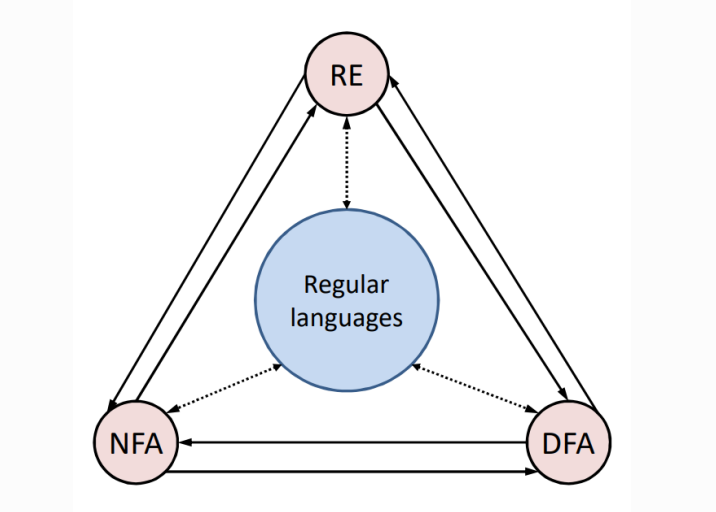
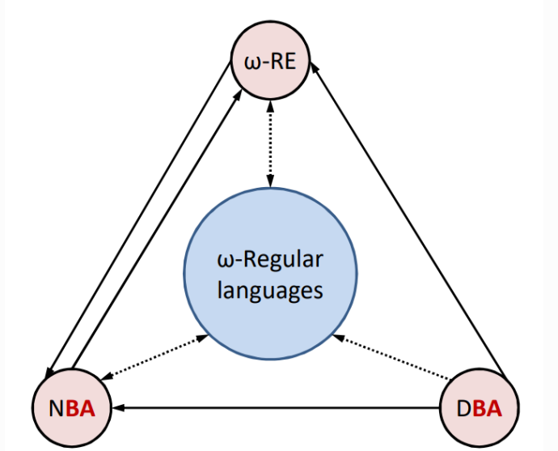

# Buchi-automaton
Theoretical Project about Büchi and Generalized Büchi automaton

This repository contains:
> * Slide: A complete English slide for Buchi automaton.
> * Report: A brief summary of the project in Persian.
> * LaTeX projec: Theese slides have been produced with LaTeX. You can use them.

